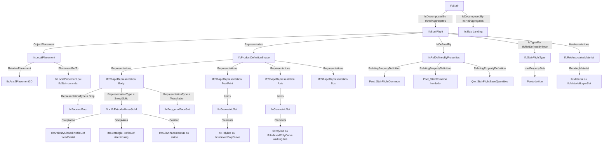
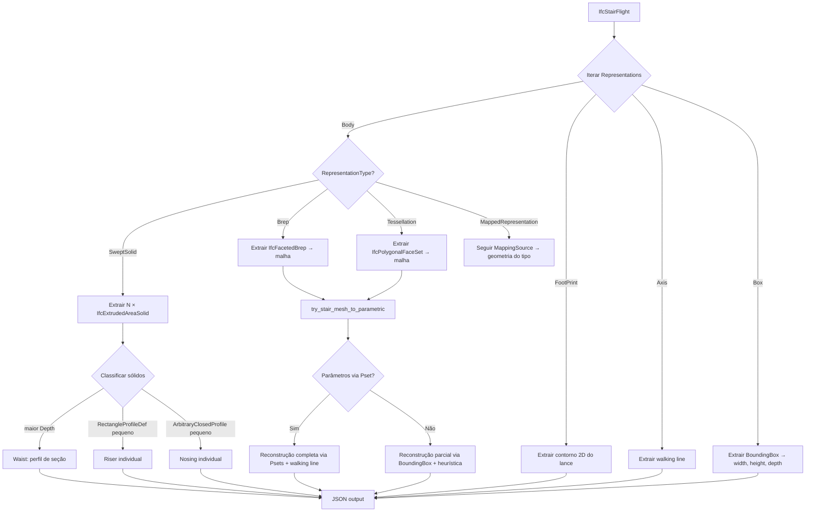

# IfcStairFlight — Reconstrução Paramétrica: Referência Técnica

> **Audiência:** Engenheiros de software e especialistas BIM/IFC que implementam pipelines de leitura, extração e reconstrução de lances de escada a partir de arquivos IFC para visualização paramétrica (Three.js) ou interoperabilidade OpenBIM.
>
> **Versão do schema de referência:** `IFC4` e `IFC4X3_ADD2`
> **Ferramenta de extração:** IfcOpenShell 0.8 · Python 3.11+
> **Renderizador de referência:** Three.js r160+

---

## Sumário

1. [Contexto e Objetivo](#1-contexto-e-objetivo)
2. [Modelo de Dados IFC do Lance de Escada](#2-modelo-de-dados-ifc-do-lance-de-escada)
3. [Catálogo de Casos de Representação](#3-catálogo-de-casos-de-representação)
4. [Álgebra de Transformações](#4-álgebra-de-transformações)
5. [Pipeline de Extração Python](#5-pipeline-de-extração-python)
6. [Reconstrução Paramétrica no Three.js](#6-reconstrução-paramétrica-no-threejs)
7. [Fontes de Dados para Validação e Enriquecimento](#7-fontes-de-dados-para-validação-e-enriquecimento)
8. [Configurações de Exportação do Revit](#8-configurações-de-exportação-do-revit)
9. [Limitações Conhecidas e Roadmap](#9-limitações-conhecidas-e-roadmap)

---

## 1. Contexto e Objetivo

### 1.1 O que significa "paramétrico" em IFC para escadas

No Revit, um lance de escada (`Stair Run`) é definido por um conjunto de constraints relacionais: número de espelhos, altura de cada espelho, profundidade do piso, espessura da laje inclinada (waist), largura do lance e tipo de arranjo (STRAIGHT, WINDER, SPIRAL). Essas constraints internas ao Revit **não são exportadas** como entidades relacionais para o IFC.

O que o IFC **formaliza** como "paramétrico" para lances de escada é:

1. **Parâmetros explícitos no elemento:** `NumberOfRiser`, `NumberOfTreads`, `RiserHeight`, `TreadLength` como atributos diretos de `IfcStairFlight` (IFC2x3, IFC4) ou via `Pset_StairFlightCommon` (IFC4X3).
2. **Representação geométrica reconstrutível:** o perfil 2D da seção transversal do lance (dente-de-serra + waist) extrudado pela largura, ou cada degrau como `IfcExtrudedAreaSolid` individual.
3. **Eixo de caminhada (`Axis`):** `IfcShapeRepresentation` com `RepresentationIdentifier = 'Axis'` — linha central que descreve a trajetória funcional do lance.
4. **Pegada em planta (`FootPrint`):** `IfcShapeRepresentation` com `RepresentationIdentifier = 'FootPrint'` — contorno 2D projetado no plano horizontal.

A reconstrução paramétrica a partir desses dados permite recriar o volume do lance com precisão geométrica sem depender de malha triangulada.

### 1.2 Diferença entre IfcStair, IfcStairFlight e IfcSlab Landing

O sistema de escadas no IFC é decomposto em:

```
IfcStair           ← agregador (não tem geometria própria em modelos Revit)
  ├── IfcStairFlight (Run 1, Run 2, ...)   ← lances com degraus
  └── IfcSlab [PredefinedType = .LANDING.] ← patamares (lajes horizontais)
```

- **`IfcStair`:** elemento contentor com `PredefinedType` indicando o tipo de escada (`.STRAIGHT_RUN_STAIR.`, `.DOUBLE_RETURN_STAIR.`, `.SPIRAL_STAIR.`, etc.). Em exportações Revit, **não carrega geometria própria**.
- **`IfcStairFlight`:** cada lance inclinado com degraus. Tem seus próprios parâmetros, placement, representação e Psets.
- **`IfcSlab [.LANDING.]`:** patamar horizontal entre lances. Tratado como laje — consultar `SLAB_PARAMETRIC_DOC.md` para reconstrução desse elemento.

> **Nota:** a relação de decomposição é `IfcRelAggregates.RelatedObjects`. Sempre navegar essa relação para agrupar lances e patamares à escada pai.

### 1.3 Por que reconstruir parametricamente

O exportador Revit converte o lance de escada para **malha** (`IfcFacetedBrep`, `IfcPolygonalFaceSet`) na grande maioria dos casos, exceto em exportações ARQ com `Allow use of mixed 'Solid Model' representation` desligado — onde gera múltiplos `IfcExtrudedAreaSolid` (um por degrau). Isso acontece porque:

- A geometria do lance é topologicamente complexa: faces inclinadas, nosings, contra-espelhos, waist variável
- O MVD `ReferenceView` (padrão atual) prioriza fidelidade visual sobre editabilidade
- Exportadores estruturais (EST) preferem `Brep` para análise FEM

A reconstrução paramétrica tem três objetivos:
1. **Reduzir dados:** um lance paramétrico com N degraus gera O(N) polígonos contra O(N × 10-30) triângulos em malha
2. **Preservar semântica:** número de espelhos, altura, profundidade — dados que alimentam memoriais, análise de acessibilidade, verificação NBR 9050
3. **Permitir interação:** highlight por degrau, cálculo de rota de escape, edição de espessura da laje inclinada

### 1.4 Escopo deste documento

- **Elemento:** `IfcStairFlight`
- **Schemas:** `IFC4` e `IFC4X3_ADD2`
- **Projetos de referência analisados:** 5 arquivos IFC de 2 projetos distintos (TECNISA TOR01/TOR02, MPD 0837)
- **Pipeline:** extração Python via IfcOpenShell 0.8 → JSON intermediário → reconstrução Three.js
- **Fora de escopo:** `IfcRamp`, `IfcRampFlight`, `IfcSlab[.LANDING.]`, escadas espirais sem parâmetros definidos

---

## 2. Modelo de Dados IFC do Lance de Escada

### 2.1 Grafo de entidades



### 2.2 Entidades-chave e seus papéis

#### `IfcStairFlight` — atributos diretos

| Atributo | Tipo | IFC4 | IFC4X3 | Descrição |
|----------|------|------|--------|-----------|
| `NumberOfRiser` | `IfcInteger` | Direto | Deprecated¹ | Número de espelhos (risers) |
| `NumberOfTreads` | `IfcInteger` | Direto | Deprecated¹ | Número de pisos (treads) |
| `RiserHeight` | `IfcPositiveLengthMeasure` | Direto | Deprecated¹ | Altura de cada espelho |
| `TreadLength` | `IfcPositiveLengthMeasure` | Direto | Deprecated¹ | Profundidade horizontal do piso |
| `PredefinedType` | `IfcStairFlightTypeEnum` | Direto | Direto | `.STRAIGHT.`, `.WINDER.`, `.SPIRAL.`, `.CURVED.`, `.FREEFORM.` |

> ¹Em IFC4X3, esses atributos foram **movidos para `Pset_StairFlightCommon`** e os campos diretos são frequentemente exportados como `$` (null). **Sempre checar ambos** na extração.

#### `Pset_StairFlightCommon` — propriedades

| Propriedade | Tipo IFC | Descrição |
|------------|----------|-----------|
| `NumberOfRiser` | `IfcCountMeasure` | Total de espelhos no lance |
| `NumberOfTreads` | `IfcCountMeasure` | Total de pisos (geralmente = risers − 1 ou = risers) |
| `RiserHeight` | `IfcPositiveLengthMeasure` | Altura nominal do espelho |
| `TreadLength` | `IfcPositiveLengthMeasure` | Profundidade nominal do piso |
| `NosingLength` | `IfcLengthMeasure` | Saliência do nariz do degrau (nosing) |
| `WalkingLineOffset` | `IfcPositiveLengthMeasure` | Distância da linha de caminhada à borda interna |
| `TreadLengthAtOffset` | `IfcPositiveLengthMeasure` | Profundidade do piso medida no offset |
| `TreadLengthAtInnerSide` | `IfcPositiveLengthMeasure` | Profundidade do piso na borda interna (relevante para escadas em leque) |
| `WaistThickness` | `IfcPositiveLengthMeasure` | Espessura da laje inclinada (waist), medida perpendicularmente ao plano inclinado |

#### `Qto_StairFlightBaseQuantities` — quantidades

| Quantity | Tipo IFC | Descrição |
|----------|----------|-----------|
| `Length` | `IfcQuantityLength` | Comprimento horizontal projetado do lance |
| `Width` | `IfcQuantityLength` | Largura do lance |
| `GrossVolume` | `IfcQuantityVolume` | Volume bruto |
| `NetVolume` | `IfcQuantityVolume` | Volume líquido |
| `GrossArea` | `IfcQuantityArea` | Área bruta (plana inclinada) |

#### `IfcStairFlightType`

Referenciado por `IfcRelDefinesByType`. Contém os `Psets` do tipo, incluindo `Pset_StairFlightCommon`, e pode ter `HasRepresentationMaps` com `IfcRepresentationMap` (geometria canônica compartilhada — análogo ao `IfcMappedItem` das lajes).

#### Representação `Axis`

A representação `Axis` (`RepresentationIdentifier = 'Axis'`) é a **linha de caminhada** do lance — uma curva 2D (ou 3D) que descreve a trajetória funcional no centro do lance ou no offset `WalkingLineOffset` da borda interna. É a fonte mais direta para reconhecimento de `STRAIGHT` vs. `WINDER` vs. `SPIRAL`.

```
#38617=IFCPOLYLINE((#38614,#38615,#38616));  ← walking line com 3 pontos (DOUBLE_RETURN)
#38618=IFCGEOMETRICSET((#38617));
#38619=IFCSHAPEREPRESENTATION(#25,'Axis','GeometricSet',(#38618));
```

> Em escadas em U (`DOUBLE_RETURN_STAIR`), o `Axis` de cada lance é um segmento de reta; a linha de caminhada completa é a composição de todos os segmentos de todos os lances.

---

## 3. Catálogo de Casos de Representação

### Visão geral — ficheiros × casos

| Ficheiro | Schema | Disciplina | `IfcStairFlight` | C1-Brep | C2-SweptSolid-Multi | C3-Tessellation |
|----------|--------|-----------|-----------------|---------|---------------------|-----------------|
| `217-EST-EX-001-TOR02_v7_TEC_ifc4.3.ifc` | IFC4X3_ADD2 | EST | 12 | Todos | — | — |
| `217-EST-EX-001-TOR01_v3_TEC.ifc` | IFC4X3_ADD2 | EST | 12 | Todos | — | — |
| `217-ARQ-EX-001-TOR01_v1_TEC_ifc43_sem_mix.ifc` | IFC4X3_ADD2 | ARQ | 75 | — | Todos | — |
| `0837-MOD-AR-LO-3000-T01-23-TIPO-R01.ifc` | IFC4 | ARQ | 88 | — | — | Todos |

> **Padrão claro:** modelos **estruturais** (EST) exportam `IfcFacetedBrep`. Modelos **arquitetônicos** (ARQ) exportam `SweptSolid` multi-item (IFC4X3 sem mix) ou `Tessellation` (IFC4 ReferenceView).

---

### Caso 1 — `Brep` (`IfcFacetedBrep`) — Modelo Estrutural

**Origem típica:** Revit EST com `CoordinationView` ou qualquer MVD quando a geometria não é decomponível em sólidos primitivos. Padrão dominante em modelos EST.

**Representações presentes:**
- `Body` → `Brep` com `IfcFacetedBrep` (shell fechado de faces planares)
- `FootPrint` → `GeometricSet` com `IfcPolyline` (retângulo aproximado do lance em planta)
- `Axis` → `GeometricSet` com `IfcPolyline` (linha de caminhada)
- `Box` → `BoundingBox`

**STEP simplificado (lance Run 1, escada DOUBLE_RETURN, TECNISA EST TOR02):**
```step
/* --- Brep do lance (geometria completa, ~25 faces) --- */
#38127=IFCCARTESIANPOINT((0.,1.2450000000000045,0.));
#38131=IFCCARTESIANPOINT((1.2600537497723678,1.2450000000000028,0.));
...
#38183=IFCCLOSEDSHELL((#38076,#38083,...,#38182));   ← ~25 faces planares
#38184=IFCFACETEDBREP(#38183);
#38186=IFCSHAPEREPRESENTATION(#26,'Body','Brep',(#38184));

/* --- FootPrint (bounding box 2D do lance em planta) --- */
#38188=IFCCARTESIANPOINT((1.2600537497723712,0.015000000000000922));
#38189=IFCCARTESIANPOINT((1.2600537497723712,1.4650000000000005));
#38190=IFCCARTESIANPOINT((0.,1.4650000000000005));
#38191=IFCCARTESIANPOINT((0.,0.015000000000000922));
#38192=IFCPOLYLINE((#38188,#38189,#38190,#38191,#38188));
#38193=IFCGEOMETRICSET((#38192));
#38194=IFCSHAPEREPRESENTATION(#28,'FootPrint','GeometricSet',(#38193));

/* --- Axis (walking line, 2 pontos = segmento central) --- */
#38195=IFCCARTESIANPOINT((0.63002687488618558,1.4650000000000005));
#38196=IFCCARTESIANPOINT((0.63002687488618558,0.015000000000000922));
#38197=IFCPOLYLINE((#38195,#38196));
#38198=IFCGEOMETRICSET((#38197));
#38199=IFCSHAPEREPRESENTATION(#25,'Axis','GeometricSet',(#38198));

/* --- BoundingBox --- */
#38200=IFCCARTESIANPOINT((0.,0.,-0.14000000000003748));
#38201=IFCBOUNDINGBOX(#38200,1.2600537497723712,1.4649999999999994,1.0150000000004449);
#38202=IFCSHAPEREPRESENTATION(#27,'Box','BoundingBox',(#38201));

#38203=IFCPRODUCTDEFINITIONSHAPE($,$,(#38186,#38194,#38199,#38202));
#38204=IFCSTAIRFLIGHT('152i7kO1XDcP8BoK40naFU',#18,
  'Escada moldada no local:Escada:1850128 Run 1',$,
  'Lance monolítico:Monolithic Run',
  #38069,   ← ObjectPlacement
  #38203,   ← Representation
  '1850129',
  $,$,$,$,  ← NumberOfRiser, NumberOfTreads, RiserHeight, TreadLength (null em IFC4X3)
  .STRAIGHT.);

/* --- Pset_StairFlightCommon (parâmetros reais) --- */
#38636=IFCPROPERTYSINGLEVALUE('NumberOfRiser',$,IFCCOUNTMEASURE(14),$);
#38637=IFCPROPERTYSINGLEVALUE('NumberOfTreads',$,IFCCOUNTMEASURE(14),$);
#38638=IFCPROPERTYSINGLEVALUE('RiserHeight',$,IFCPOSITIVELENGTHMEASURE(0.17),$);
#38639=IFCPROPERTYSINGLEVALUE('TreadLength',$,IFCPOSITIVELENGTHMEASURE(0.29),$);
#38640=IFCPROPERTYSINGLEVALUE('NosingLength',$,IFCLENGTHMEASURE(0.015),$);
#38641=IFCPROPERTYSINGLEVALUE('WalkingLineOffset',$,IFCPOSITIVELENGTHMEASURE(2.067),$);
#38644=IFCPROPERTYSET('3G2...',#18,'Pset_StairFlightCommon',$,(#38636,...,#38643));
```

**Dados extraíveis:**
- `n_risers`, `n_treads`, `riser_height`, `tread_length`, `nosing_length` ← `Pset_StairFlightCommon`
- `walking_line_pts` ← `Axis` representation (segmento)
- `footprint_pts` ← `FootPrint` representation (retângulo)
- `width` ← `FootPrint.xdim` ou `Qto_StairFlightBaseQuantities.Width`
- `flight_length` = n_treads × tread_length
- `flight_height` = n_risers × riser_height
- `bounding_box` ← `Box` representation (x, y, z extent)
- `waist_thickness` ← `Pset_StairFlightCommon.WaistThickness` (se presente)
- `predefined_type` = `.STRAIGHT.`

**Limitação:** sem `SweptSolid`, a geometria é puro `Brep`. A reconstrução paramétrica é **100% baseada nos Psets + Axis + FootPrint**. `WaistThickness` frequentemente ausente em modelos EST — precisa de heurística via BoundingBox.

---

### Caso 2 — `SweptSolid` Multi-item — Degraus como Sólidos Individuais

**Origem típica:** Revit ARQ com exportação IFC4X3 (`CoordinationView`, sem mistura de sólidos e mesh). Cada degrau é um sólido extrudado individual: o piso (tread) como `IfcArbitraryClosedProfileDef`, o contra-espelho (riser) como `IfcRectangleProfileDef`, e o nariz (nosing) como perfil pequeno.

**Representações presentes:**
- `Body` → `SweptSolid` com N × `IfcExtrudedAreaSolid` (tipicamente: 4 por degrau = waist + tread + riser + nosing)
- `FootPrint` → `GeometricSet` com `IfcPolyline`
- `Axis` → `GeometricSet` com `IfcPolyline`
- `Box` → `BoundingBox`

**STEP simplificado (lance Run 1, escada montada, TECNISA ARQ):**
```step
/* --- Waist (laje inclinada) do lance completo --- */
#545604=IFCCARTESIANPOINT((-0.0079015552156096354,-0.084968750000045112));
...
#545608=IFCPOLYLINE((#545604,#545605,#545606,#545607,#545604));
#545609=IFCARBITRARYCLOSEDPROFILEDEF(.AREA.,'AcabamentoEscada...',#545608);
#545610=IFCCARTESIANPOINT((0.,0.87790155521560731,0.36504374999997929));
#545611=IFCAXIS2PLACEMENT3D(#545610,#5,#8);       ← Z=(-0,0,-1), X=(0,1,0)? orientação inclinada
#545612=IFCEXTRUDEDAREASOLID(#545609,#545611,#9,1.2499995691229262);  ← width=1.25m

/* --- Riser (contra-espelho retangular) --- */
#545615=IFCRECTANGLEPROFILEDEF(.AREA.,'AcabamentoEscada...',#545614,1.2499995,0.30499999);
#545616=IFCCARTESIANPOINT((0.62499978456146521,0.73337372462760919,0.4500124999998858));
#545617=IFCAXIS2PLACEMENT3D(#545616,#9,#6);       ← orientado verticalmente
#545618=IFCEXTRUDEDAREASOLID(#545615,#545617,#9,0.00080);  ← espessura do riser = 0.8mm

/* --- (repete para cada degrau: waist + riser + nosing) --- */
...

/* --- Body: todos os sólidos em um único ShapeRepresentation --- */
#545669=IFCSHAPEREPRESENTATION(#27,'Body','SweptSolid',
  (#545582,#545588,#545597,#545603,#545612,#545618,#545627,#545633,#545642,#545651,#545657));
  /* ↑ 11 sólidos para 4 degraus (waist completo + 3× riser + nosing) */

/* --- FootPrint (retângulo do lance) --- */
#545671=IFCCARTESIANPOINT((1.2499995691229262,0.015873724627612058));
...
#545675=IFCPOLYLINE((#545671,#545672,#545673,#545674,#545671));
#545677=IFCSHAPEREPRESENTATION(#29,'FootPrint','GeometricSet',(#545676));

/* --- Axis --- */
#545678=IFCCARTESIANPOINT((0.62499978456146521,1.4658737246276117));
#545679=IFCCARTESIANPOINT((0.6249997845614631,0.015873724627612058));
#545680=IFCPOLYLINE((#545678,#545679));
#545682=IFCSHAPEREPRESENTATION(#26,'Axis','GeometricSet',(#545681));

#545686=IFCPRODUCTDEFINITIONSHAPE($,$,(#545669,#545677,#545682,#545685));
#545687=IFCSTAIRFLIGHT('3$iKhkct5AJPlE8j6bmR19',#18,
  'Escada montada:Escada:864796 Run 1',$,
  'Lance não monolítico:AcabamentoEscada-ConcretoDesempenado',
  #545573,#545686,'864944',$,$,$,$,.STRAIGHT.);
```

**Dados extraíveis:**
- Cada `IfcExtrudedAreaSolid` → posição, orientação, perfil, profundidade individuais
- `width` ← `Depth` dos sólidos waist (extrusão lateral)
- `waist_profile_pts` ← `SweptArea` do waist (dente-de-serra)
- `riser_dims` ← `RectangleProfileDef` (width × altura riser)
- `footprint_pts`, `walking_line_pts` ← `FootPrint` e `Axis`
- Parâmetros escalares ← `Pset_StairFlightCommon` (caso disponível)

**Estratégia de extração:** identificar o sólido com maior `Depth` (extrusão lateral) como o waist; risers são os `RectangleProfileDef` menores; nosings são perfis trapezoidais ou muito finos.

**Limitação:** o número de `IfcExtrudedAreaSolid` por degrau varia com o tipo de escada e configuração Revit. Não há tag explícita que identifique "este sólido é o waist" vs. "este é o riser" — requer heurística por `Depth` e perfil.

---

### Caso 3 — `Tessellation` (`IfcPolygonalFaceSet`) + `FootPrint` + `Axis`

**Origem típica:** Revit ARQ com `ReferenceView_V1.2` (IFC4). Geometria completa do lance em uma única `IfcPolygonalFaceSet` (ou múltiplas para risers separados), com `FootPrint` e `Axis` como `IfcIndexedPolyCurve`.

**Representações presentes:**
- `Body` → `Tessellation` com múltiplos `IfcPolygonalFaceSet` (um por degrau ou um por componente de cor)
- `FootPrint` → `GeometricSet` com `IfcIndexedPolyCurve`
- `Axis` → `GeometricSet` com `IfcIndexedPolyCurve` (walking line)

**STEP simplificado (lance Run 1, MPD ARQ):**
```step
/* --- Tessellation: um PolygonalFaceSet por degrau (~9 sólidos cúbicos) --- */
#37002=IFCCARTESIANPOINTLIST3D(((0.,0.28,0.242),(0.,0.,0.242),(1.25,0.,0.242),
  (1.25,0.28,0.242),(0.,0.28,0.100),(0.,0.232,0.070),(0.,0.,0.070),(1.25,0.,0.070),
  (1.25,0.232,0.070),(1.25,0.28,0.100),...));  ← 52 pontos para todos os degraus
#36967=IFCINDEXEDPOLYGONALFACE((1,2,3,4));
#36968=IFCINDEXEDPOLYGONALFACE((5,6,7,8,9,10));
...
#37003=IFCPOLYGONALFACESET(#37002,.T.,(#36967,...,#37001),$);

/* --- Body: todos os PolygonalFaceSets --- */
#37006=IFCSHAPEREPRESENTATION(#24,'Body','Tessellation',
  (#36883,#36897,...,#37003));  ← 9 FaceSets (9 degraus)

/* --- FootPrint (IfcIndexedPolyCurve com 5 pts = retângulo do lance) --- */
#37008=IFCCARTESIANPOINTLIST2D(((0.,2.24),(0.,0.),(1.25,0.),(1.25,2.24),(0.,2.24)));
#37009=IFCINDEXEDPOLYCURVE(#37008,$,.F.);
#37010=IFCGEOMETRICSET((#37009));
#37011=IFCSHAPEREPRESENTATION(#26,'FootPrint','GeometricSet',(#37010));

/* --- Axis (walking line, linha central) --- */
#37012=IFCCARTESIANPOINTLIST2D(((0.625,0.),(0.625,2.24)));
#37013=IFCINDEXEDPOLYCURVE(#37012,$,.F.);
#37014=IFCGEOMETRICSET((#37013));
#37015=IFCSHAPEREPRESENTATION(#23,'Axis','GeometricSet',(#37014));

#37016=IFCPRODUCTDEFINITIONSHAPE($,$,(#37006,#37011,#37015));
#37017=IFCSTAIRFLIGHT('3PbBJdN9b8CftCZOzkGNJA',#18,
  'Escada moldada no local:Escada:2835333 Run 1',$,
  'Lance monolítico:CONCRETO 12cm',
  #36874,#37016,'3537418',$,$,$,$,.STRAIGHT.);
```

**Dados extraíveis:**
- `footprint_pts` ← `FootPrint` (retângulo ou polígono do lance)
- `walking_line_pts` ← `Axis` (segmento central)
- `width` = `footprint_pts[2][0] - footprint_pts[0][0]` (para lance reto)
- `flight_length` = `footprint_pts[1][1] - footprint_pts[0][1]`
- Parâmetros escalares ← `Pset_StairFlightCommon`
- `waist_thickness` via nome do tipo: `'CONCRETO 12cm'` → 12cm (fallback heurístico pelo nome)
- Geometria de degrau por heurística: contar `IfcPolygonalFaceSet` por volume e inferir geometria

**Limitação:** sem geometria paramétrica do `Body`. A reconstrução completa depende dos parâmetros do `Pset` + `FootPrint` + `Axis`. O número de FaceSets pode dar contagem de degraus, mas os ângulos e perfis precisam ser calculados.

---

## 4. Álgebra de Transformações

### 4.1 Cadeia de placements — IfcStairFlight

O placement do lance de escada segue a mesma lógica hierárquica do `IfcSlab`, com uma camada extra: o `IfcStair` pode ter seu próprio `IfcLocalPlacement`, que é pai do placement do lance.

```
IfcProject.WorldCoordinateSystem
  └── IfcSite.ObjectPlacement
       └── IfcBuilding.ObjectPlacement
            └── IfcBuildingStorey.ObjectPlacement
                 └── IfcStair.ObjectPlacement         ← aggregador (pode ser $)
                      └── IfcStairFlight.ObjectPlacement
```

> **Atenção:** em modelos Revit, `IfcStair.ObjectPlacement` é frequentemente `$` (null). Nesse caso, os lances têm placement diretamente em relação ao andar.

### 4.2 Conversão `IfcAxis2Placement3D` → `THREE.Matrix4`

Idêntico ao descrito em `SLAB_PARAMETRIC_DOC.md`, Seção 4:

```python
def axis2placement_to_matrix4(ap3d):
    """
    ap3d: IfcAxis2Placement3D
    Retorna lista 16-floats em column-major (THREE.Matrix4.elements)
    """
    loc = ap3d.Location.Coordinates          # ponto de origem
    z   = ap3d.Axis.DirectionRatios if ap3d.Axis else (0,0,1)
    x   = ap3d.RefDirection.DirectionRatios if ap3d.RefDirection else (1,0,0)

    # Normalizar e ortoganolizar
    Z = normalize(z)
    X = normalize(x)
    Y = cross(Z, X)

    # column-major para Three.js
    return [
        X[0], X[1], X[2], 0,
        Y[0], Y[1], Y[2], 0,
        Z[0], Z[1], Z[2], 0,
        loc[0], loc[1], loc[2], 1
    ]
```

### 4.3 Placement do `IfcExtrudedAreaSolid` em lances multi-item

No Caso 2 (SweptSolid multi-item), cada `IfcExtrudedAreaSolid` tem seu próprio `Position` (`IfcAxis2Placement3D`) **relativo ao sistema de coordenadas local do lance** (não ao espaço global).

A transformação composta para um ponto `p` no espaço local do sólido individual é:

```
p_world = M_world_flight × M_solid_local × p_local_solid
```

onde:
- `M_world_flight` = produto de toda a cadeia `IfcLocalPlacement` do lance
- `M_solid_local` = matrix do `IfcAxis2Placement3D` do sólido individual

### 4.4 Eixo de extrusão inclinado (waist)

O waist de um lance STRAIGHT é uma laje inclinada. O `IfcExtrudedAreaSolid` do waist tem `Position.Axis` apontando **perpendicular ao plano inclinado**, não para cima (Z global). O ângulo de inclinação α é:

```
α = arctan(riser_height / tread_length)     [ângulo de rampa, típico 20°–40°]

Position.Axis = (0, -sin(α), cos(α))        [apontando para cima do plano inclinado]
Position.RefDirection = (0, cos(α), sin(α)) [direção horizontal no plano inclinado]
ExtrudedDirection = (0, 0, 1)               [perpendicular ao perfil, = direção da largura]
```

> O `Depth` do sólido waist é a **largura** do lance (ex.: 1.25 m), pois a extrusão é perpendicular ao perfil 2D que está no plano de corte transversal do lance.

### 4.5 Coordenadas do `FootPrint` e `Axis`

Diferente de `IfcSlab`, as representações `FootPrint` e `Axis` de `IfcStairFlight` estão em **coordenadas locais do lance** (relativas ao seu `ObjectPlacement`), não em coordenadas mundiais. Isso é confirmado pelo padrão observado nos projetos: os pontos do FootPrint de cada lance têm origem em `(0,0)` ou próxima.

Para obter as coordenadas mundiais do contorno do lance:
```python
pts_world = [transform_pt(pt, flight_world_matrix) for pt in footprint_pts]
```

---

## 5. Pipeline de Extração Python

### 5.1 Fluxo de decisão por `RepresentationType`



### 5.2 Função de extração — estrutura

```python
def extract_stair_flight(element, ifc_file):
    """
    element: IfcStairFlight
    Retorna dict no schema JSON definido em 5.3
    """
    result = {
        "id": element.GlobalId,
        "name": element.Name,
        "predefined_type": str(element.PredefinedType) if element.PredefinedType else "NOTDEFINED",
        "geom_strategy": None,   # "swept_multi" | "brep" | "tessellation"
        "steps": [],             # lista de degraus individualmente se swept_multi
        "waist": None,           # perfil e espessura da laje inclinada
        "footprint_2d": None,    # contorno 2D local
        "walking_line": None,    # [pt_start, pt_end] ou lista de pts
        "bounding_box": None,    # {x, y, z, dx, dy, dz}
        "params": {},            # Pset_StairFlightCommon
        "world_matrix": None,    # composição de ObjectPlacement
        "mesh": None,            # fallback tessellation
    }

    # 1. Transformação mundial
    result["world_matrix"] = _get_world_matrix(element.ObjectPlacement)

    # 2. Parâmetros do Pset_StairFlightCommon
    result["params"] = _extract_stair_psets(element, ifc_file)

    # 3. Atributos diretos (IFC4 backward compat)
    if element.NumberOfRiser and "n_risers" not in result["params"]:
        result["params"]["n_risers"] = int(element.NumberOfRiser)
    if element.RiserHeight and "riser_height" not in result["params"]:
        result["params"]["riser_height"] = float(element.RiserHeight)
    if element.TreadLength and "tread_length" not in result["params"]:
        result["params"]["tread_length"] = float(element.TreadLength)

    # 4. Iterar representações
    if element.Representation:
        for rep in element.Representation.Representations:
            ident = rep.RepresentationIdentifier
            rtype = rep.RepresentationType
            if ident == "Body":
                _extract_body(rep, rtype, result)
            elif ident == "FootPrint":
                result["footprint_2d"] = _extract_curve_rep(rep)
            elif ident == "Axis":
                result["walking_line"] = _extract_curve_rep(rep)
            elif ident == "Box":
                result["bounding_box"] = _extract_bbox(rep)

    return result


def _extract_body(rep, rtype, result):
    if rtype == "SweptSolid":
        result["geom_strategy"] = "swept_multi"
        for item in rep.Items:
            if item.is_a("IfcExtrudedAreaSolid"):
                solid_data = _classify_stair_solid(item)
                if solid_data["role"] == "waist":
                    result["waist"] = solid_data
                else:
                    result["steps"].append(solid_data)

    elif rtype == "Brep":
        result["geom_strategy"] = "brep"
        for item in rep.Items:
            if item.is_a("IfcFacetedBrep"):
                result["mesh"] = _extract_faceted_brep(item)

    elif rtype == "Tessellation":
        result["geom_strategy"] = "tessellation"
        verts, faces = [], []
        for item in rep.Items:
            if item.is_a("IfcPolygonalFaceSet"):
                _append_polygonal_face_set(item, verts, faces)
        result["mesh"] = {"vertices": verts, "faces": faces}


def _classify_stair_solid(eas):
    """
    Classifica IfcExtrudedAreaSolid de lance de escada:
    - 'waist': sólido com maior Depth (= largura do lance)
    - 'riser': RectangleProfileDef com Depth mínimo (espessura contra-espelho)
    - 'nosing': ArbitraryClosedProfileDef pequeno
    """
    depth = float(eas.Depth)
    profile = eas.SweptArea
    solid_matrix = _axis2placement_to_matrix4(eas.Position)

    if profile.is_a("IfcRectangleProfileDef"):
        xdim = float(profile.XDim)
        ydim = float(profile.YDim)
        if depth > 0.5:   # heurística: depth > 50cm = é a largura do lance
            role = "waist_rect"
        else:
            role = "riser"
        return {"role": role, "profile": "rectangle",
                "xdim": xdim, "ydim": ydim, "depth": depth,
                "solid_matrix": solid_matrix}

    elif profile.is_a("IfcArbitraryClosedProfileDef"):
        pts = _polyline_to_pts(profile.OuterCurve)
        role = "waist" if depth > 0.5 else "nosing"
        return {"role": role, "profile": "arbitrary",
                "pts_2d": pts, "depth": depth,
                "solid_matrix": solid_matrix}

    return {"role": "unknown", "depth": depth, "solid_matrix": solid_matrix}
```

### 5.3 Schema JSON de saída

```json
{
  "id": "152i7kO1XDcP8BoK40naFU",
  "name": "Escada moldada no local:Escada:1850128 Run 1",
  "predefined_type": "STRAIGHT",
  "geom_strategy": "brep",

  "params": {
    "n_risers": 14,
    "n_treads": 14,
    "riser_height": 0.17,
    "tread_length": 0.29,
    "nosing_length": 0.015,
    "walking_line_offset": 2.067,
    "tread_length_at_offset": 0.29,
    "tread_length_at_inner": 0.29,
    "waist_thickness": null
  },

  "waist": {
    "role": "waist",
    "profile": "arbitrary",
    "pts_2d": [[x0,y0], [x1,y1], "..."],
    "depth": 1.25,
    "solid_matrix": [16 floats col-major]
  },

  "steps": [
    {
      "role": "riser",
      "profile": "rectangle",
      "xdim": 1.25,
      "ydim": 0.17,
      "depth": 0.0008,
      "solid_matrix": [16 floats]
    }
  ],

  "footprint_2d": [[0,0.015], [1.26,0.015], [1.26,1.465], [0,1.465]],
  "walking_line": [[0.63, 1.465], [0.63, 0.015]],
  "bounding_box": {"ox":0, "oy":0, "oz":-0.14, "dx":1.26, "dy":1.465, "dz":1.015},

  "world_matrix": [16 floats col-major],
  "mesh": null
}
```

### 5.4 Cobertura atual vs. lacunas

| Representação | Cobertura | Dados paramétricos | Lacuna |
|--------------|-----------|-------------------|--------|
| `SweptSolid` multi-item | Parcial | Alta (perfis individuais) | Classificação de role depende de heurística por `Depth` |
| `Brep` | Parcial (via mesh) | Apenas via Psets + FootPrint | `WaistThickness` ausente nos projetos EST analisados |
| `Tessellation` | Parcial (via mesh) | Via Psets + FootPrint | Sem acesso a geometria de degrau |
| `MappedRepresentation` | Ausente | — | Precisa seguir `MappingSource` |
| `Axis` walking line | Ausente | Presente nos ficheiros | Não implementado ainda |
| `Pset_StairFlightCommon` | Ausente | Alta | Implementação prioritária |

---

## 6. Reconstrução Paramétrica no Three.js

### 6.1 Estratégia A — Reconstrução completa via parâmetros (geom_strategy: "brep" | "tessellation")

Quando a geometria de `Body` é malha mas os `Psets` têm todos os parâmetros, é possível reconstruir o lance geometricamente correto do zero.

**Perfil 2D do lance (seção transversal):**
```
O perfil de corte de um lance STRAIGHT com N degraus,
riser_height R e tread_length T é um "dente-de-serra":

(0, N×R)
  ├── piso N  ↔ (T, N×R) → (T, (N-1)×R) → ...
  ├── espelho N-1
  ├── ...
  ├── piso 1  ↔ (T, R)
  ├── espelho 1 ↔ (T, 0) → (0, 0)
  └── waist: fecha pelo plano inclinado inferior
```

**Código Three.js:**
```js
function buildStairProfile(nRisers, riserH, treadL, nosingL, waistT) {
  // 1. Perfil dente-de-serra (vista lateral, plano XZ)
  const shape = new THREE.Shape();
  shape.moveTo(0, 0);

  for (let i = 0; i < nRisers; i++) {
    const x0 = i * treadL;
    const z0 = i * riserH;
    shape.lineTo(x0 + nosingL, z0);           // nariz do piso
    shape.lineTo(x0 + nosingL, z0 + riserH);  // espelho
    shape.lineTo(x0 + treadL,  z0 + riserH);  // patamar (próximo degrau)
  }

  // 2. Fecha pelo plano inclinado inferior (waist)
  const alpha = Math.atan2(riserH, treadL);   // ângulo de inclinação
  const totalH = nRisers * riserH;
  const totalL = nRisers * treadL;
  shape.lineTo(totalL, totalH);               // topo direito
  // descida perpendicular ao plano inclinado
  const perpX = Math.sin(alpha) * waistT;
  const perpZ = Math.cos(alpha) * waistT;
  shape.lineTo(totalL - perpX, totalH - perpZ);
  // linha de baixo paralela ao waist
  shape.lineTo(0 - perpX,  0  - perpZ);
  shape.lineTo(0, 0);   // fecha

  return shape;
}

function buildStairFlight(params, width) {
  const { n_risers, riser_height, tread_length, nosing_length } = params;
  const waistT = params.waist_thickness ?? 0.12;  // fallback 12cm

  const profile = buildStairProfile(
    n_risers, riser_height, tread_length,
    nosing_length ?? 0, waistT
  );

  // Extrude pelo eixo Y (largura do lance)
  const extrudeSettings = {
    depth: width,
    bevelEnabled: false,
    extrudePath: new THREE.LineCurve3(
      new THREE.Vector3(0, 0, 0),
      new THREE.Vector3(0, width, 0)
    )
  };

  // ExtrudeGeometry opera no plano XY; nosso perfil está em XZ
  // → rotar o perfil ou usar ShapeGeometry + custom extrude
  const geo = new THREE.ExtrudeGeometry(profile, {
    depth: width,
    bevelEnabled: false
  });
  // ExtrudeGeometry extride em Z; queremos em Y → rotacionar
  geo.applyMatrix4(new THREE.Matrix4().makeRotationX(Math.PI / 2));

  return geo;
}
```

**Aplicar transformação mundial:**
```js
function applyFlightTransform(geo, flightData) {
  const M = new THREE.Matrix4();
  M.fromArray(flightData.world_matrix);
  geo.applyMatrix4(M);
  return geo;
}
```

### 6.2 Estratégia B — Reconstrução por sólidos individuais (geom_strategy: "swept_multi")

Cada `IfcExtrudedAreaSolid` no JSON (`waist` + `steps[]`) é reconstruído individualmente e merged.

```js
function buildStepSolid(solidData) {
  let geo;
  if (solidData.profile === "rectangle") {
    // Riser: caixa retangular
    geo = new THREE.BoxGeometry(solidData.xdim, solidData.ydim, solidData.depth);
  } else {
    // Waist ou nosing: perfil arbitrary extrudado
    const shape = new THREE.Shape(
      solidData.pts_2d.map(([x, y]) => new THREE.Vector2(x, y))
    );
    geo = new THREE.ExtrudeGeometry(shape, {
      depth: solidData.depth,
      bevelEnabled: false
    });
  }

  // Aplicar solid_matrix (posição local no lance)
  const M_solid = new THREE.Matrix4().fromArray(solidData.solid_matrix);
  geo.applyMatrix4(M_solid);
  return geo;
}

function buildSweptMultiFlight(flightData) {
  const geos = [];

  // Waist
  if (flightData.waist) {
    geos.push(buildStepSolid(flightData.waist));
  }

  // Risers, nosings, etc.
  for (const step of flightData.steps) {
    geos.push(buildStepSolid(step));
  }

  // Merge com BufferGeometryUtils ou CSG
  const merged = BufferGeometryUtils.mergeGeometries(geos);

  // Aplicar world_matrix do lance
  const M_world = new THREE.Matrix4().fromArray(flightData.world_matrix);
  merged.applyMatrix4(M_world);
  return merged;
}
```

### 6.3 Estratégia C — Fallback: mesh tessellada com parâmetros no userData

Quando nem os parâmetros nem a geometria paramétrica estão disponíveis:

```js
function buildTessellatedFlight(flightData) {
  // Usar a mesh do body diretamente
  const { vertices, faces } = flightData.mesh;
  const geo = buildBufferGeometryFromMesh(vertices, faces);

  // Aplicar world_matrix
  const M = new THREE.Matrix4().fromArray(flightData.world_matrix);
  geo.applyMatrix4(M);

  // Preservar parâmetros para análise posterior
  const mesh = new THREE.Mesh(geo, material);
  mesh.userData = {
    type: "IfcStairFlight",
    predefined_type: flightData.predefined_type,
    ...flightData.params,
    footprint: flightData.footprint_2d,
    walking_line: flightData.walking_line,
  };
  return mesh;
}
```

### 6.4 Visualização da walking line e footprint

A `walking_line` e o `footprint_2d` são dados 2D locais ao lance. Para visualização:

```js
function buildWalkingLine(flightData) {
  const M = new THREE.Matrix4().fromArray(flightData.world_matrix);
  const pts = flightData.walking_line.map(([x, y]) => {
    const v = new THREE.Vector3(x, y, 0).applyMatrix4(M);
    return v;
  });
  const geo = new THREE.BufferGeometry().setFromPoints(pts);
  return new THREE.Line(geo, new THREE.LineBasicMaterial({ color: 0xff0000 }));
}
```

### 6.5 Winding order e normais

- `ExtrudeGeometry` do Three.js usa convenção CCW para normais apontando para fora
- O perfil `buildStairProfile` deve ser definido CCW quando visto de fora (do lado do observador)
- Ao aplicar `makeRotationX(Math.PI / 2)` para mudar plano XY → XZ, as normais permanecem corretas pois é uma rotação pura (sem espelhamento)
- Para sólidos do Caso 2, verificar o `solid_matrix`: se o determinante for negativo (espelhamento), inverter a ordem dos índices das faces

---

## 7. Fontes de Dados para Validação e Enriquecimento

### 7.1 Prioridade de confiança para parâmetros escalares

| Dado | Fonte 1 (maior confiança) | Fonte 2 | Fonte 3 | Fallback |
|------|--------------------------|---------|---------|----------|
| `n_risers` | `Pset_StairFlightCommon.NumberOfRiser` | Atributo direto `IfcStairFlight.NumberOfRiser` | Contar `IfcPolygonalFaceSet` no Body | BoundingBox.dz / riser_height |
| `riser_height` | `Pset_StairFlightCommon.RiserHeight` | Atributo direto | pts Z de vértices do mesh | BoundingBox.dz / n_risers |
| `tread_length` | `Pset_StairFlightCommon.TreadLength` | Atributo direto | pts XY do mesh | BoundingBox.dy / n_treads |
| `nosing_length` | `Pset_StairFlightCommon.NosingLength` | Atributo direto | Sólido nosing no Caso 2 | 0 (omitir) |
| `width` | `Qto_StairFlightBaseQuantities.Width` | `Depth` do sólido waist (Caso 2) | FootPrint xdim | BoundingBox.dx |
| `waist_thickness` | `Pset_StairFlightCommon.WaistThickness` | Nome do tipo (ex.: "12cm") | Espessura mínima do mesh | 0.12 m padrão NBR |
| `walking_line_offset` | `Pset_StairFlightCommon.WalkingLineOffset` | Posição X do Axis | — | width/2 |

### 7.2 Extrair parâmetros do `Pset_StairFlightCommon`

```python
def _extract_stair_psets(element, ifc_file):
    params = {}
    MAP = {
        "NumberOfRiser":          "n_risers",
        "NumberOfTreads":         "n_treads",
        "RiserHeight":            "riser_height",
        "TreadLength":            "tread_length",
        "NosingLength":           "nosing_length",
        "WalkingLineOffset":      "walking_line_offset",
        "TreadLengthAtOffset":    "tread_length_at_offset",
        "TreadLengthAtInnerSide": "tread_length_at_inner",
        "WaistThickness":         "waist_thickness",
    }
    for rel in element.IsDefinedBy:
        if not rel.is_a("IfcRelDefinesByProperties"):
            continue
        pset = rel.RelatingPropertyDefinition
        if not pset.is_a("IfcPropertySet"):
            continue
        for prop in pset.HasProperties:
            if prop.Name in MAP and prop.NominalValue:
                key = MAP[prop.Name]
                val = prop.NominalValue.wrappedValue
                if key in ("n_risers", "n_treads"):
                    params[key] = int(val)
                else:
                    params[key] = float(val)
    return params
```

### 7.3 Inferência de `WaistThickness` quando ausente

Ordem de tentativas:
1. `Pset_StairFlightCommon.WaistThickness`
2. Nome do `IfcStairFlightType`: `re.search(r'(\d+)\s*cm', type_name)` → converte para metros
3. `IfcMaterialLayerSet.MaterialLayers[0].LayerThickness` (se houver material com camadas)
4. Heurística geométrica: `bounding_box.dz / (n_risers + cos(alpha))` — estimativa via geometria do envelope
5. Padrão NBR 9050/IEC: 0.12 m (12 cm) como valor conservador

### 7.4 Relacionamento com `IfcStair` pai

```python
def get_parent_stair(flight, ifc_file):
    """Retorna o IfcStair pai do lance via IfcRelAggregates."""
    for rel in flight.Decomposes:
        if rel.is_a("IfcRelAggregates"):
            parent = rel.RelatingObject
            if parent.is_a("IfcStair"):
                return parent
    return None

def get_stair_type(stair):
    """PredefinedType do IfcStair pai (ex.: DOUBLE_RETURN_STAIR)."""
    return str(stair.PredefinedType) if stair and stair.PredefinedType else "NOTDEFINED"
```

---

## 8. Configurações de Exportação do Revit

### 8.1 Objetivo e contexto

Exportar `IfcStairFlight` com o máximo de informações paramétricas para minimizar o trabalho de reconstrução. O comportamento do Revit varia significativamente por **disciplina** (ARQ vs. EST), **MVD** escolhido e **versão do schema IFC**.

### 8.2 Tabela de configurações críticas

| Opção de Export | Valor recomendado | Efeito no IfcStairFlight |
|----------------|------------------|--------------------------|
| **IFC Version** | `IFC4X3_ADD2` | `IfcStairFlight` com atributos modernos; Psets mais completos |
| **Export as** | `CoordinationView` | Gera `SweptSolid` multi-item para ARQ; `Brep` para EST |
| **Level of Detail** | `Low` ou `Medium` | `Low` → reduz faces no Brep/Tessellation; `Medium` → nosings preservados |
| **Keep Tessellated Geometry as Triangulation** | `Desligado` | Gera `IfcPolygonalFaceSet` (mais compacto) em vez de triângulos puros |
| **Allow use of mixed 'Solid Model' representation** | `Desligado` | Força `SweptSolid` puro quando possível (Caso 2); `Ligado` pode misturar Brep+Swept |
| **Export Revit Property Sets** | `Ligado` | Exporta Psets proprietários Revit (parâmetros adicionais) |
| **Export IFC Common Property Sets** | `Ligado` | Garante `Pset_StairFlightCommon` e `Pset_StairCommon` |
| **Export base quantities** | `Ligado` | Garante `Qto_StairFlightBaseQuantities` com Width, Length, Volume |
| **Classification** | `OmniClass Table 23` ou `Uniformat` | Adiciona `IfcClassificationReference` ao lance — útil para filtros |
| **Coordinate Reference** | `Shared Coordinates` | Alinha com BIM coordenado; `Internal Origin` pode gerar offsets grandes |

### 8.3 Comportamento por disciplina

| Disciplina Revit | MVD sugerido | Body típico | Psets |
|-----------------|--------------|-------------|-------|
| **ARQ** (`Architecture`) | `CoordinationView` sem mix | `SweptSolid` multi-item (Caso 2) | Completos |
| **ARQ** com `ReferenceView` | `ReferenceView_V1.2` | `Tessellation` (Caso 3) | Completos |
| **EST** (`Structure`) | `CoordinationView` | `Brep` (Caso 1) | Parciais — `WaistThickness` ausente |

> **Recomendação principal:** para o objetivo de reconstrução paramétrica, **usar modelo ARQ com `CoordinationView` e `Allow mixed` desligado**. Isso gera `SweptSolid` multi-item (Caso 2), que é o mais informativo geometricamente para lances de escada. O modelo EST pode ser usado para enriquecer os parâmetros estruturais (espessura de waist, armação), mas sua representação `Brep` não é reconstrutível sem os Psets.

### 8.4 Checklist de export para máxima reconstrutibilidade

```
□ IFC Version: IFC 4x3 (IFC4X3_ADD2)
□ MVD: CoordinationView
□ Allow use of mixed 'Solid Model' representation: DESLIGADO
□ Keep Tessellated Geometry as Triangulation: DESLIGADO
□ Export IFC Common Property Sets: LIGADO
□ Export base quantities: LIGADO
□ Export Revit Property Sets: LIGADO
□ Level of Detail: Medium (preserva nosings)
□ Coordinate Reference: Shared Coordinates
□ Split walls and columns by floor level: SIM (organização hierárquica)
□ Export linked files as separate IFCs: conforme necessidade do projeto
□ Classification: OmniClass Table 23 (code 23-13 13 11 = Stairs)
□ Include IFCSITE and IFCBUILDING: SIM (hierarquia completa)
```

### 8.5 Verificação pós-export com IfcOpenShell

```python
import ifcopenshell

def audit_stair_flights(ifc_path):
    model = ifcopenshell.open(ifc_path)
    flights = model.by_type("IfcStairFlight")

    report = {"total": len(flights), "by_geom": {}, "missing_params": []}
    for f in flights:
        if not f.Representation:
            continue
        for rep in f.Representation.Representations:
            if rep.RepresentationIdentifier == "Body":
                rtype = rep.RepresentationType
                report["by_geom"][rtype] = report["by_geom"].get(rtype, 0) + 1
                break
        params = _extract_stair_psets(f, model)
        if "riser_height" not in params or "tread_length" not in params:
            report["missing_params"].append(f.GlobalId)

    return report
```

---

## 9. Limitações Conhecidas e Roadmap

### 9.1 Limitações estruturais (independentes de implementação)

| Limitação | Causa raiz | Impacto |
|-----------|-----------|---------|
| `WaistThickness` ausente em modelos EST | Revit EST não exporta esse Pset por padrão | Reconstrução sem espessura real do waist |
| `IfcStairFlight.NumberOfRiser = $` em IFC4X3 | Parâmetro migrado para Pset | Compatibilidade retroativa requer dupla checagem |
| Escadas em leque (WINDER) sem geometria paramétrica | Profile 2D varia por degrau | Sem suporte além de tessellation |
| Escadas helicoidais (SPIRAL) | Geometria 3D complexa, sem primitivas simples | Somente tessellation disponível |
| `RepresentationType = MappedRepresentation` | Geometria está no `IfcStairFlightType` | Extrator não segue a referência |
| Nosings como objetos separados | Alguns templates Revit exportam nosing como `IfcBuildingElementPart` separado | Não agrupados com o lance principal |

### 9.2 Limitações do extrator atual

| Funcionalidade | Status | Prioridade |
|---------------|--------|-----------|
| Leitura de `Pset_StairFlightCommon` | Não implementado | **Alta** |
| Extração de `Axis` walking line | Não implementado | **Alta** |
| Extração de `FootPrint` do lance | Não implementado | **Alta** |
| Classificação de sólidos no Caso 2 (waist vs. riser) | Não implementado | Alta |
| Suporte a `IfcMappedItem` no lance | Não implementado | Média |
| Heurística de `WaistThickness` via nome do tipo | Não implementado | Média |
| Inferência de parâmetros via BoundingBox | Não implementado | Média |
| Navegação `IfcRelAggregates` para agrupar lances ao `IfcStair` pai | Não implementado | Alta |
| Validação geométrica: `n_risers × riser_height ≈ bounding_box.dz` | Não implementado | Baixa |

### 9.3 Roadmap de implementação — fases

#### Fase 1 — Extração de metadados (sem geometria)
1. Implementar `_extract_stair_psets()` — leitura de `Pset_StairFlightCommon`
2. Implementar extração de `Axis` (walking line) e `FootPrint`
3. Implementar extração de `BoundingBox` para fallback de dimensões
4. Navegar `IfcRelAggregates` para associar lances ao `IfcStair` pai e `IfcSlab[LANDING]`

**Resultado:** JSON com parâmetros completos mesmo quando Body é Brep ou Tessellation. Permite Estratégia A de reconstrução Three.js (perfil analítico).

#### Fase 2 — Extração de geometria paramétrica (Caso 2)
1. Detectar `RepresentationType = SweptSolid` com múltiplos items
2. Implementar `_classify_stair_solid()` com heurística por Depth e ProfileDef
3. Extrair `pts_2d` do waist e `dims` dos risers/nosings

**Resultado:** JSON com `waist` e `steps[]` preenchidos. Permite Estratégia B no Three.js.

#### Fase 3 — Heurísticas de waist e validação
1. Inferência de `WaistThickness` via nome do tipo com regex
2. Validação geométrica: comparar parâmetros calculados vs. BoundingBox
3. Adicionar `confidence_score` por campo (0–1) baseado na fonte dos dados
4. Suporte a `IfcMappedRepresentation` — seguir para geometria do tipo

**Resultado:** Extrator robusto com fallbacks encadeados e rastreabilidade.

#### Fase 4 — Reconstrução Three.js
1. Implementar `buildStairProfile()` para `STRAIGHT` (analítico)
2. Implementar `buildSweptMultiFlight()` para sólidos individuais
3. Visualização de walking line como overlay
4. Highlight de degraus individuais (seleção interativa)
5. Cálculo de ângulo de inclinação e exibição de conformidade NBR 9050

### 9.4 Referências e padrões

| Recurso | Referência |
|---------|-----------|
| Especificação `IfcStairFlight` IFC4X3 | [https://ifc43-docs.buildingsmart.org/IFC/RELEASE/IFC4x3/HTML/lexical/IfcStairFlight.htm](https://ifc43-docs.buildingsmart.org/IFC/RELEASE/IFC4x3/HTML/lexical/IfcStairFlight.htm) |
| `Pset_StairFlightCommon` | [https://ifc43-docs.buildingsmart.org/IFC/RELEASE/IFC4x3/HTML/lexical/Pset_StairFlightCommon.htm](https://ifc43-docs.buildingsmart.org/IFC/RELEASE/IFC4x3/HTML/lexical/Pset_StairFlightCommon.htm) |
| `Qto_StairFlightBaseQuantities` | buildingSMART Data Dictionary |
| Acessibilidade NBR 9050 | ABNT NBR 9050:2020 — espelho máx. 18cm, piso mín. 28cm |
| `IfcStairFlightTypeEnum` | `.STRAIGHT.`, `.WINDER.`, `.SPIRAL.`, `.CURVED.`, `.FREEFORM.`, `.NOTDEFINED.` |
| Relatório complementar | `SLAB_PARAMETRIC_DOC.md` (patamares de escada = `IfcSlab[.LANDING.]`) |
